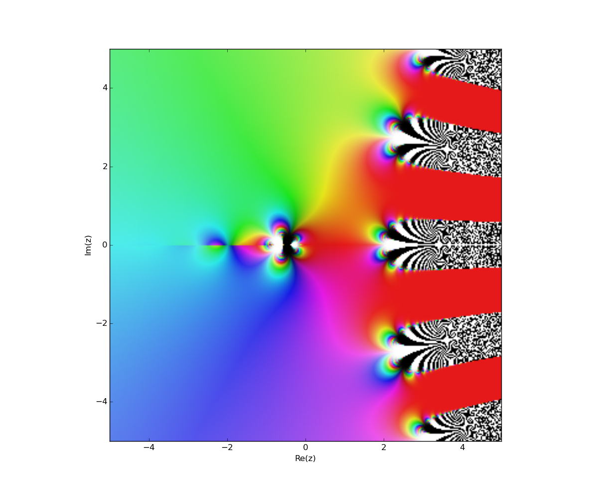

# Hyperoperators

[](https://travis-ci.org/thoppe/python-hyperoperators)
[](https://coveralls.io/github/thoppe/python-hyperoperators?branch=master)
[](https://badge.fury.io/py/hyperop)
  
`hyperop` is a small library for representing really, really, ridiculously large numbers in pure python. It does so using [hyperoperations](https://en.wikipedia.org/wiki/Hyperoperation).

+ Hyperoperation 0, `H0` is the [successor function](https://en.wikipedia.org/wiki/Successor_function), `H0(None, 4) = 5`
+ `H1` is [addition](https://en.wikipedia.org/wiki/Addition), `H1(2,4) = 2 + (1+1+1+1) = 6`
+ `H2` is [multiplication](https://en.wikipedia.org/wiki/Multiplication) (repeated addition), `H2(2,4) = 2+2+2+2 = 8`
+ `H3` is [exponentiation](https://en.wikipedia.org/wiki/Exponentiation) (repeated multiplication), `H3(2,4) = 2*2*2*2 = 16`
+ `H4` is [tetration](https://en.wikipedia.org/wiki/Tetration) (repeated exponentiation) `H4(2,4) = 2^(2^(2^(2))) = 65536`
+ ...
+ Hyperoperation n is repeated Hyperoperation (n-1)


Fundamentally, hyperop works recursively by applying a [fold-right](https://en.wikipedia.org/wiki/Fold_(higher-order_function)) operation:
  
    H[n](x,y) = reduce(lambda x,y: H[n-1](y,x), [a,]*b)


### Installation

    pip install hyperop

To install the latest version use:

    pip install git+https://github.com/thoppe/python-hyperoperators

### Examples

``` python
from hyperop import hyperop

H1 = hyperop(1)
print H1(2,3), H1(3,2), H1(5,4)
# >> 5, 5, 8

H3 = hyperop(3)
print H3(2,3), H3(3,2), H3(5,4)
# >> 8, 9, 243

from math import log
H = hyperop(4)
print H(2,5)
>>> 200352993040684646497....45587895905719156736

print log(log(log(log(H(2,5),2.0),2.0),2.0),2.0) == 2
>>> True  
```
  
Approximate infinite tetration. Show that sqrt(2)^sqrt(2)^... where the tower continues an infinite amount of times is 2.

``` python
H4 = hyperop(4)
print H4(2**0.5, 200)
# >> 2.0
```
  

Calculate the incomprehensibly large, but finite [Graham's number](https://en.wikipedia.org/wiki/Graham%27s_number):

``` python
def GrahamsNumber():
    # This may take awhile...
    g = 6
    for n in range(1,64+1):
        g = hyperop(g)(3,3)
    return g
```
  
Plot the phase angle on the complex plane over tetrating four times `H4(z,4)`

``` python
from hyperop import hyperop
import mpmath

H = hyperop(4)
f = lambda z: H(z,4)
mpmath.cplot(f, verbose=True, points=100000)
```



 
### Caveats
  
Higher order hyperoperations (from tetration and above) are _not_ associative, thus tetration `H4(2,4) = 2^(2^(2^(2))) = 65536` is not `H4(2,4) != 2^(2*2*2) = 256`.

Since tetration is not defined for non-integral heights, the domain of pentation `H5` and above is restricted to non-negative integer values.

### Talks & Press

This library was first presented at DC's Hack && Tell (Feb. 2016).

[http://thoppe.github.io/python-hyperoperators/HnT_pres.html](http://thoppe.github.io/python-hyperoperators/HnT_pres.html#/)

# License

This work is licensed under a <a rel="license" href="http://creativecommons.org/licenses/by-sa/4.0/">Creative Commons Attribution-ShareAlike 4.0 International License</a>.